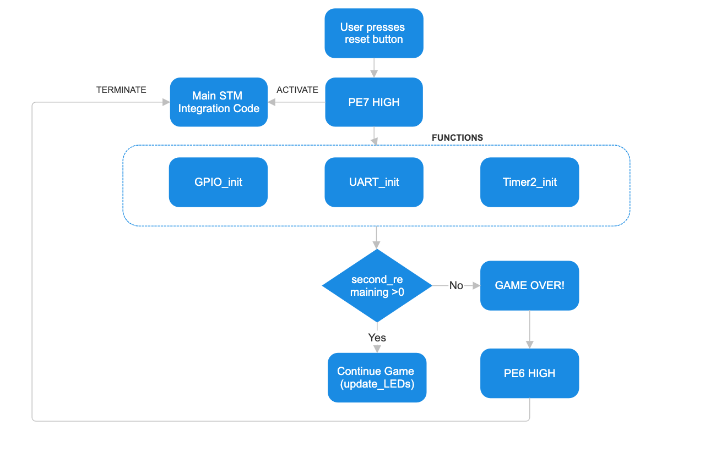

# Group_1_2025_MTRX2700_major_project-3

## Details about the project
### Group Member Roles & Responsibilities:

- **Sharon Britto**  
  Responsible for Riddle & Intergation Module. Wrote code and user instructions.

- **Lillie Mellin**  
  Responsible for TSC Module. Wrote code and user instructions.

- **Luc Do**  
 Responsible for Potentiometer & User Interface . Wrote code and user instructions.

- **Melvin Lanojan**  
 Responsible for Lidar Module. Wrote code and user instructions.

- **Jason Yang**  
 Responsible for Timer Module. Wrote code and user instructions.


Hi Adventurer! Welcome to Pirates of the C-ribbean! 
This user guide will take you through the instructions of the game, and then we will dive deeper into what makes up its functionality. 

## Instructions of the Game 
You have set sail to find the hidden treasure - but there are 4 challenges you must first complete before you get the gold! 

### Navigating Rocky Shores 
Reaching the treasure won’t be easy. Your first challenge is to guide your ship through treacherous waters filled with jagged rocks.

You’ll have to steer past shifting obstacles and navigate your way to the next island for 90 seconds. Precision and timing are key, or you’ll be dashed against the rocks like the many who came before.

For each rock that faces your path, you will have 10 seconds to make the lights indicate green to show you've successfully veered from capsizing.

And this is only the beginning — you haven’t even reached the first island yet.

## Riddle Island 
Woohoo! You have managed to get to the first island. To unlock a clue to the next island, you have to correctly answer a few mind boggling questions. 

You will be presented with one riddle that you need to answer correctly. Input your answer into the text box after reading the question. You do not need to worry about capatalising, just ensure your answer is spelt correctly. You will be able to request for a hint after a certain amount of time, but to do this, you need to locate the hidden button in the island. 

Once you have completed this, you will be asked to answer a quick maths questions. You will then need to apply a Ceaser Cipher shift of this value to the last riddle answer you had. Completing all these challenges unlocks a further island, and a step closer to the treasure!

### Blinking Light Shores 
Hi Matey, this is a test of your wit and your coordination. 

An LED pattern of length 6 will be displayed. Remember the order. These 8 LEDs on the STM correspond to the 8 sensor positions on the helm exactly. 

After the LED pattern is displayed touch the sensors on the helm in the correct pattern. You must be touching the sensor by the time the blue light flashes!!

Move quickly between sensors. 

A tip from one pirate to another: make sure you're touching the first sensor by the time the LED pattern stops as ships are unruly creatures and setting sail is the hardest part!


### Treasure Island
Ahoy! You've found the treasure chest, but its locked! There is a mysterious dial on the ground.

1. Maths questions will be printed to the screen, you must solve them with pirate speed!
2. Note whether the answer to the question is odd or even.
3. If the answer is odd, twist ye dial to the left (red LED will light)
4. If the answer is even, twist ye dial to the right (green LED will light)
5. Get all the questions right, and the treasure is yours!!! Arrggggh!!!

## Code Description
### Lidar Module
#### Overview
This module challenges the player to navigate "rocky shores" by using a joystick to pan and tilt a LIDAR-equipped platform. The player must manually scan for nearby obstacles. If an object is detected within 30 cm, a red LED alerts the user to steer away. Once clear, a green LED indicates safe passage.

The LIDAR is mounted on a dual-servo pan-tilt unit (PTU), and its orientation is controlled in real-time via analog joystick input.

#### Hardware Interface

| Component   | STM32 Pin(s)     | Description                  |
| ----------- | ---------------- | ---------------------------- |
| Joystick X  | PC1 (ADC1\_IN3)  | Controls horizontal (pan)    |
| Joystick Y  | PA4 (ADC2\_IN1)  | Controls vertical (tilt)     |
| Pan Servo   | PA1 (TIM2\_CH2)  | PWM output                   |
| Tilt Servo  | PA15 (TIM2\_CH1) | PWM output                   |
| LIDAR (PWM) | PA8 (TIM1\_CH1)  | Pulse width encodes distance |
| Red LED     | PA10             | ON when obstacle < 30 cm     |
| Green LED   | PA9              | ON when no nearby obstacle   |

#### Key Features
- Smooth joystick-based PTU control using filtered ADC input mapped to servo PWM values.
- PWM-based LIDAR distance measurement using input capture interrupt on TIM1.
- Filtered distance reading via a rolling average over 5 samples.
- LED feedback system for player awareness (safe vs. obstacle detected).
- Failsafe logic to detect and handle missing LIDAR signals.

#### Core Control Loop

```
while (1) {
    read_joystick();              // Read ADC for pan & tilt
    update_servo_pwm();          // Smooth movement toward target PWM
    read_filtered_distance();    // Compute filtered LIDAR value
    update_leds();               // Red/Green LED based on proximity
    HAL_Delay(20);               // Maintain ~50Hz loop
}
```

#### Functions

| Function Name              | Description                                                                                  |
|---------------------------|----------------------------------------------------------------------------------------------|
| `map(val, in_min, in_max, out_min, out_max)` | Maps a value from one range to another, used to convert ADC readings to PWM ranges.         |
| `get_filtered_distance()` | Returns a rolling average of the last 5 LIDAR distance readings for noise reduction.         |
| `enable_clocks()`         | Enables AHB peripheral clocks for GPIO ports A, C, and E.                                    |
| `initialise_board()`      | Configures PE8–PE15 on the Discovery board as output for onboard LEDs.                       |
| `HAL_TIM_IC_CaptureCallback()` | Callback triggered on input capture event from TIM1, calculates pulse width for LIDAR distance.   |
| `SystemClock_Config()`    | Configures system clocks for HSE, PLL, and peripheral buses.                                 |
| `MX_GPIO_Init()`          | Initializes GPIO pins for LEDs, I/O, and alternate functions.                                |
| `MX_I2C1_Init()`          | Configures I2C1 peripheral for LIDAR or PTU communication.                                   |
| `MX_USB_PCD_Init()`       | Initializes USB peripheral for PCD communication (not used directly in LIDAR loop).          |
| `MX_TIM1_Init()`          | Sets up TIM1 for input capture mode to read PWM signal from LIDAR.                           |
| `MX_TIM2_Init()`          | Initializes TIM2 to generate PWM signals for PTU pan and tilt servo motors.                 |
| `MX_ADC1_Init()`          | Initializes ADC1 (PA2) for reading the horizontal joystick (X-axis).                         |
| `MX_ADC2_Init()`          | Initializes ADC2 (PA4) for reading the vertical joystick (Y-axis).                           |
| `main()`                  | Main entry point: initializes all modules and runs the joystick control and LIDAR check loop.|
| `Error_Handler()`         | Stops system execution in case of an error (used for debug and development).                 |
| `assert_failed()`         | Debug helper to report assertion failures if `USE_FULL_ASSERT` is enabled.                   |


#### Testing 

| Scenario                 | Expected Output                     |
| ------------------------ | ----------------------------------- |
| Object detected at 25 cm | Red LED ON, Green LED OFF           |
| Clear space (>30 cm)     | Green LED ON, Red LED OFF           |
| Joystick tilt            | LIDAR tilts up/down smoothly        |
| Joystick pan             | LIDAR pans left/right smoothly      |
| LIDAR signal dropout     | Reverts to default distance (300mm) |


### Riddle Module 


This module constructs an interactive riddle game utilsizing UART communication to interact with the user via a serial terminal. The gameplay consists of three stages: answering a riddle, solving a basic math problem, and applying a Caesar cipher. The riddle is selected randomly from a predefined array of Riddle structs, wcih contans the riddle,its answer and two hints, and the player must respond correctly to proceed to the next stage.The game flow is managed within the riddle_game() function, which contains the main loop that processes user input and tracks progression through each challenge step. The functionality is controlled by if-else statements and while loops as its basis. 

Key supporting functions include AskNewRiddle(), which selects and displays a random riddle; AskMathQuestion(), which generates a simple addition problem; and AskCaesarChallenge(), which prompts the user to encode the riddle’s answer using a Caesar cipher. The Caesar cipher logic itself is implemented in CaesarCipher(), which shifts each character in the input string by a specified amount, defined by the generated math answer. Controls are placed within both AskNewRiddle() and AskMathQuestion() function that ensures no two riddles are the same and the sum is not 0:

```
static void AskNewRiddle(void) {
  …

    do {
        index = rand() % NUM_RIDDLES;
    } while (index == last_index);  // Ensure it’s not the same as the last one
…
}

static void AskMathQuestion(void) {
    do {
        math_1 = rand() % 5;
        math_2 = rand() % 5;
        math_answer = math_1 + math_2;
    } while (math_answer == 0);  // Avoid 0 + 0

 …
}

```
To ensure efficient input comparison, all strings received by UART are converted to lowercase before processing via ToLowerCase() function. This allows users to enter answers without worrying about letter casing, simplifying the input format and reducing the chance of errors due to grammar. All user input is captured from the UART interface using SerialGetChar() and echoed back with SerialOutputChar(). Once the module is completed, the module updates the global variable game_progress, which is a key component to the progression of the game. 

For additional complexity of the module, the use of hints is included, providing the user with support if needed. This is done through the use of a physical button input that provides a readable high signal that is taken as an input and compared within the code. This input is read by input in PE7, after configuring the pin and adding a pull down resistor for accuracy. The hint is only provided after a certain time limit, which is controlled by an internal clock SysTick_Init() and a rising edge of the input pin. If not already found, the user is notified, and hints are able to be requested at 10 second intervals. 
```
if (!button_hint_shown && elapsed >= 1000 && riddle_step == 0 && !hint_button_used) {
           printf("\r\nThere's a button hidden on this island. Find it and gain a hint!\r\n\n> ");
           button_hint_shown = 1;
       }
       // === Hint button check (PE7) ===
       if (riddle_step == 0 && (GPIOE->IDR & GPIO_IDR_7) != 0) {
           hint_button_used = 1;
	    // Conditions to be met to provide a hint


          // Code for providing a hint
       }
```
If the user answers the riddle correctly within a short time period, the AskNewRiddle() function is called once more and provides the user with a new Riddle and any corresponding hints. 

#### Testing
To test the functionality of the module, certain tests were conducted and compared to the known expected behaviour. If these are aligned correctly, the module can be deemed as functional. Please note, the inputs answer and caesar are dependent on the riddle, and is only stated to demonstrate testing outcomes: 

<table>
  <thead>
    <tr>
      <th>Sub module</th>
      <th>User Input</th>
      <th>Expected Output</th>
    </tr>
  </thead>
  <tbody>
    <tr>
      <td rowspan="8">Riddle</td>
      <td>answer &gt; 45 seconds</td>
      <td>Correct! On to the next challenge…<br>Now answer this: What is 4 + 2?</td>
    </tr>
    <tr>
      <td>ANswER</td>
      <td>Correct! On to the next challenge…<br>Now answer this: What is 4 + 2?</td>
    </tr>
    <tr>
      <td>answer &lt; 45 secs</td>
      <td>Correct! Wow, you're quick. So here's another one!</td>
    </tr>
    <tr>
      <td>Wanswer</td>
      <td>Wrong! Try again:</td>
    </tr>
    <tr>
      <td>answer1</td>
      <td>Wrong! Try again:</td>
    </tr>
    <tr>
      <td>PE7 high &gt; 45 seconds</td>
      <td>Here’s a hint to help you: Hint</td>
    </tr>
    <tr>
      <td>PE7 high &lt; 45 seconds</td>
      <td>You have to wait 45 seconds before getting a hint.</td>
    </tr>
    <tr>
      <td>PE7 low &gt; 45 seconds</td>
      <td>There's a button hidden on this island. Find it and gain a hint!</td>
    </tr>
    <tr>
      <td rowspan="4">Math Question</td>
      <td>6</td>
      <td>Nicely done! Final challenge…<br>Final task! Enter the Caesar cipher of the riddle answer with a shift of 6.</td>
    </tr>
    <tr>
      <td>5</td>
      <td>Incorrect. What is 4 + 2?</td>
    </tr>
    <tr>
      <td>A</td>
      <td>Incorrect. What is 4 + 2?</td>
    </tr>
    <tr>
      <td>HellO</td>
      <td>Incorrect. What is 4 + 2?</td>
    </tr>
    <tr>
      <td rowspan="3">Caesar Cipher</td>
      <td>ceaser</td>
      <td>Well done! You've completed the riddle island!</td>
    </tr>
    <tr>
      <td>CeASER</td>
      <td>Well done! You've completed the riddle island!</td>
    </tr>
    <tr>
      <td>wceaser</td>
      <td>Not quite! Try the Caesar cipher again with a shift of %6</td>
    </tr>
  </tbody>
</table>

### TSC Module
#### Overview: 
The Touch Sensing Control (TSC) module game allows players to interact with a 3D-printed ship helm with 8 touch sensors, mirroring the circular LED arrangement on the STM32F3Discovery board. The game begins upon receiving a HIGH signal from a master board. A pattern of 6 LEDs illuminates to form a sequence, which the player must memorize and replicate by touching the corresponding helm sensors. A blinking blue LED indicates when a sensor should be touched. The win condition is a correctly replicated sequence where a green LED is activated and a high signal is sent back to the master board. A lose condition is an error in sequence or timing when the touch sensors are touched which is indicated on a red LED and the game is repeated. 

The flow summary is as follows:
- LED pattern shown → user observes
- Blue LED blinks for each sensor → user must touch at that moment
- TSC reads touch sensor values → mapped to LED pattern
- Compare user touches to correct pattern 
- Green LED + HIGH signal if match, Red LED + repeat if not

#### Main (`main.c`):
The main loop initialises HAL, system clocks, GPIO, TSC peripherals and UART on USART1 for debugging. It is the entry point to the module so it includes only public headers. Internal hardware configurations and low-level TSC logic are encapsulated in game.c and led_control.c for the purpose of effective encapsulation. 
The main logic waits for a HIGH signal on PD4 from the master board to call `StartMiniGame(&htsc)` from game.c which begins the game and manages the gameplay logic. 
```
if (GPIOD->IDR & (1 << 4))  // Check PD4 HIGH
       {
           StartMinigame(&htsc);
           break; 
       }`
```

The TSC groups were configured according the following pins in the system core:
| Group | Sampling (G#_IO3) | Resistor (G#_IO2) | Empty (G#_IO4) |
|-------|-------------------|-------------------|----------------|
| 1     | PA2               | PA1               | PA3            |
| 2     | PA6               | PA5               | PA7            |
| 3     | PB1               | PB0               | PB2            |
| 5     | PB6               | PB4               | PB7            |
| 6     | PB13              | PB12              | PB14           |
| 8     | PD14              | PD13              | PD15           |


#### LED Control (led.c):
The LED control file is responsible for creating the flashing sequence where one LED at a time blinks on and off, guiding the player. Specifically, it manages initialising the LEDs on GPIOE pins 8-15 and is responsible for displaying the circular LED pattern to the STM using `LED_DisplayPattern(pattern, PATTERN_LENGTH, 400)` which is called at the beginning of `StartMiniGame`. Pattern is a pointer to an array of 'uint8_t' values, where each value represents the index of an LED to activate. It is a constant to ensure that the pattern inside the game.c function (which is declared as static) cannot be altered to preserve the integrity of the game. 

#### Gameplay (game.c):
`StartMinigame(TSC_HandleTypeDef *htsc)` in game.c is the main game loop handling pattern playback, touch input and result checking. It uses TSC hardware register access configured using HAL in main.c for precise touch sampling, maps the LED indices to TSC groups for input verification, provides visual (LEDs) feedback and HIGH signalling. The pseudo code below describes the logic process:

Call `LED_Displaypatternv to display predefined pattern (`pattern[] = = {0,2,4,1,5,7}`)
Loop over pattern of length 6 
Convert LED index (`pattern[i]`) to corresponding TSC group index
Increment to skip problematic TSC groups (4,7) 
Configure TSC to enable current capacitive touch electrode for sampling
Start acquisition
Wait for End of Acquisition Flag 
Reads raw capacitive sensor value 
Compares to threshold where touch detected if below threshold
Records user response, either correct or 0xFF for a miss
Blue LED (PC7) blinks to indicate when user should touch
If user_input is the correct pattern (success), light green (PC9), send HIGH (PD3) and exit loop
Else light red (PC8)'

#### How the touch detection pattern mapping works:
1: Pattern Playback (LEDs)
- `pattern[] = {0,2,4,1,5,7}` defines a sequence of LEDs to light up.
- Each `pattern[i]` corresponds to a touch sensor on the helm (via TSC group mapping).

2: TSC Group Mapping
- TSC groups are numbered 1–8.
- Each group corresponds to a specific touch electrode/sensor (matching the physical helm).
- To convert an LED index to TSC group: `group = pattern[i] + 1` (adjusted to skip groups 4,7).
- For example:
  - `pattern[0]=0` → `group=1`
  - `pattern[1]=2` → `group=3`
  - `pattern[2]=4` → `group=5`

3️: Touch Detection Logic
- During each step:
  - The system enables only one TSC group (matching the pattern).
  - The user must touch the correct sensor when the blue LED blinks.
  - `HAL_TSC_GroupGetValue()` reads the capacitive value.
  - If the value is less than the threshold, it counts as a valid touch.

4️: Pattern Matching
- `Game_CheckPattern(correct_pattern, user_input, length)` compares each entry:
```
c
for (uint8_t i = 0; i < length; i++) {
    if (correct_pattern[i] != user_input[i]) return false;
}
```
  - If any sensor was not touched correctly or at the right time `user_input[i] = 0xff` and mismatch occurs 
  - Success means the player replicated the pattern in the correct sequence and timing


#### Output for debugging when connected to laptop via USART1: 
```
Received
Touch Sensor Test Starting
Watch the LEDs closely and touch the sensors in the same pattern.
You have two seconds per sensor.
Group 1 raw: 2823
Group 3 raw: 2509
Group 5 raw: 951
Group 2 raw: 1439
Group 6 raw: 1762
Group 8 raw: 2910
Wrong pattern. Restarting…

Group 1 raw: 1287
Group 1 TOUCHED!
Group 3 raw: 1204
Group 3 TOUCHED!
Group 5 raw: 714
Group 5 TOUCHED!
Group 2 raw: 984
Group 2 TOUCHED!
Group 6 raw: 1015
Group 6 TOUCHED!
Group 8 raw: 1296
Group 8 TOUCHED!
Correct pattern! You win!
```


### Potentiometer Module 
### Overview:
The potentiometer game is a test of the players quick maths skills, as questions are rapid fired from the GUI interface, and the user responds via the turning of a physical potentiometer on the island. After the game begins in the overall flow logic (LDR signal sent), the game initialises and prints instructions to the screen. Five addition questions are sent one by one, and for odd answers the user has to twist the potentiometer left (sending a low voltage to the STM via a comparator circuit), or twist right for even answers (high voltage). If the player gets each question right, the game ramps up in difficulty, switching to multiplication for the final 5 questions. There is a period of 4s between the code asking the question and checking the users answers, so you have to be quick!

### Main file (main.c):
Within the main file, only two functions from potentiometer.c are exposed:
-	potentiometer_game();
-	InitialisePA5AsInput();

The initialise function is called along with a number of other pin initialisations used in other modules, via an overarching function in main called initialise_all(). For this module, the pin initialisation simply configured GPIOA, then set pin PA5 to receive high or low signal as input. This signal was then implemented into the game logic.

The function potentiometer_game() was the only other function exposed via the header, which meant the entire game remained very modular and protected. The calling of that one function then ran the rest of the game, with the logic hidden away in potentiometer.c.

### Potentiometer.c file:

This file contained the primary gameplay and logic to run the game. The following are key aspects of the code.

1: Use of TIM2 Timer
- Upon startup of the game, the timer TIM2 was configured and started
- Due to the game requiring user input to start ("Press enter to start"), the timer was guaranteed to be be at a different value for each iteration of the game
- The rand() function was used for the generation of the maths questions, and the timer was used via ```srand(TIM2->CNT);```

2: User instructions
- Following the timer configuration, a number of welcome and instruction messages are printed to the terminal 
- The game requires user input to the terminal ("Press enter to start"), where the system checks for the '/r' or '/n' characters before beginning the game

3: Gameplay
- An if statement is used to check the number of questions that have been asked, then either an addition or multiplication question is asked
- PA5 is checked for high or low signal, and this determines whether the play loses and restarts the game, or continues
- If all 10 questions are answered correctly, the screen prints "You win!!!" and the main.c logic moves to the game completion stage (e.g chest opening via motor)

#### Testing

To test the effectiveness of this module, the first debugging step was to add LED's in series with the comparator output, wired so that one would light when the output was low, and one when it was high. This allowed us to visualise the working comparator, and debug the code independently without worrying about loose connections. 

Further, an STM LED PE8 was configured as an output within the code, turning on when the input was high and off when it was low. This furthered the debugging by showing that the STM input was recieving correctly, and the signal was ready to be implemented into the code.

| Scenario                 | Expected Output                       |
| ------------------------ | -----------------------------------   |
| Potentiometer twist left | Red LED ON, Green LED OFF, STM LED OFF|
| Potentiometer twist right| Green LED ON, Red LED OFF, STM LED ON |

### Additional Modules
1: Motor Module
- An additional module was written to control a small motor that would open a chest at the completion of the game
- The motor was a small PWM continuous motor
- The code configured the motor, then exposed the functions ```start_motor_forward()``` and ```stop_motor()``, to start and stop the motor
- A delay was then used to determine the time for which the motor would run, before turning off
- Physical testing was used to find the time that the motor should run to open the chest fully
  
2: Buzzer Module
- This module controlled a small passive buzzer, to produce a range of frequencies
- The passive buzzer changed pitch based on the frequency of the AC voltage input
- Function were written within the buzzer.c module, then called in the main loop
- Different frequencies and delay times were used to write songs


### Timer Module 

#### Overview:
The Timer LED module implements a countdown timer (default: 480 seconds) using STM32F3Discovery's onboard GPIO LEDs and UART. The timer begins automatically upon startup and updates the LED strip (PE8–PE15) to visually indicate progress. Two additional LEDs—LED X and LED Y (PE7 and PE6)—indicate the start and end of the timer respectively. LED X turns on immediately to signal the beginning, and LED Y lights up at timeout. UART1 (TX: PA9) is used to display the time in mm:ss format on a connected terminal for debugging and tracking.

Pin Mapping: 

| Function               | Port | Pin  | Description                              |
|------------------------|------|------|------------------------------------------|
| LED 0 (Rightmost)      | PE   | 15   | Countdown LED (blinks at start)          |
| LED 1                  | PE   | 14   | Countdown LED                            |
| LED 2                  | PE   | 13   | Countdown LED                            |
| LED 3                  | PE   | 12   | Countdown LED                            |
| LED 4                  | PE   | 3    | Countdown LED                            |
| LED 5                  | PE   | 10   | Countdown LED                            |
| LED 6                  | PE   | 2    | Countdown LED                            |
| LED 7 (Leftmost)       | PE   | 8    | Countdown LED                            |
| LED X (Timer Start)    | PE   | 7    | ON when timer starts, OFF at end         |
| LED Y (Timer End)      | PE   | 6    | OFF initially, ON when timer completes   |

The timer ticks every second using TIM2, with a blinking effect on the current countdown LED. All logic and hardware abstraction are modularised across gpio.c, timer.c, and uart.c to maintain clarity and reusability.

The flow summary is as follows:
- LED X (PE7) lights up when timer starts
- Every second, LEDs update visually to reflect progress
- Active LED blinks to indicate time passage
- UART prints countdown in mm:ss format
- When timer hits zero:
  - LED X turns off
  - LED Y (PE6) turns on
  - UART prints “Game Over!”

#### Main (main.c):
The main function initialises all modules—GPIO, UART, and Timer. It starts the countdown and hands off control to interrupt-driven logic. No looping logic is required in main as all updates are handled in TIM2_IRQHandler.

```
gpio_init();
uart_init();
timer2_init();
uart_send_string("--- Timer Started ---");
```

#### LED Control (gpio.c, gpio.h):
This module handles:
- Configuration of all 10 LEDs (PE8–PE15 for strip, PE7 for LED X, PE6 for LED Y)
- Updating LED states every second based on timer value
- Blinking behavior of the current active LED using blink_state

```
update_LEDs(uint16_t seconds);  // Called every second by ISR
```

- LEDs turn off one-by-one from right to left every 10 seconds
- Active LED blinks using blink_state toggled each ISR
- LED X (start) ON at boot, turned OFF on timeout
- LED Y (end) ON only on timeout

#### UART Debugging (uart.c, uart.h):
- UART1 (TX: PA9) initialised at 115200 baud
- Sends real-time countdown every second via:

```
uart_send_time(seconds_remaining); // Outputs "\rMM:SS"
```

- Sends final message on timeout: "00:00 - Game Over!"

#### Timer Control and ISR (timer.c, timer.h):
- TIM2 configured for 1Hz interrupt:
  - Prescaler: 8000–1
  - Auto-reload: 1000–1
- On every TIM2 interrupt:
  - seconds_remaining is decremented
  - blink_state is toggled
  - LEDs and UART are updated
- At 0 seconds:
  - LED X turned OFF
  - LED Y turned ON
  - Final UART message sent

```
void TIM2_IRQHandler(void);
```

Helper functions:
- get_blink_state() used by LED logic
- get_seconds_remaining() used by UART display

#### Debug Output via UART1:
```
--- Timer Started ---
01:20
01:19
01:18
...
00:02
00:01
00:00 - Game Over!
```

#### Testing:
| Sub Module     | User Input / Condition              | Expected Output                                      |
|----------------|-------------------------------------|------------------------------------------------------|
| Timer Start    | Power ON                            | UART prints "--- Timer Started ---" + "08:00"        |
| Countdown      | Every 1 second                      | Timer decrements by 1, UART updates MM:SS format     |
| LED Display    | 10 seconds elapsed                  | LED 0 (PE15) OFF, LED 1 (PE14) starts blinking       |
| LED Blinking   | Current active LED                  | Blinks every second while it's the current segment   |
| LED Sequence   | 70 seconds elapsed                  | All LEDs OFF except PE8, which blinks               |
| LED X          | On timer start                      | PE7 turns ON for 2 seconds, then OFF                |
| LED Y          | Timer reaches 00:00                 | PE6 turns ON, PE7 turns OFF                          |
| UART Output    | Timer reaches 00:00                 | UART prints "00:00 - Game Over!"                    |
| UART Output    | Any time decrement                  | UART prints updated MM:SS string                    |
| Interrupt Test | TIM2 IRQ handler triggers           | Updates blink state, seconds, LEDs, and UART        |

### Integration 


The integration combines all individual modules to compose a fully functional game. The main components that control this is the current island and the game progress. To control these, the current island that the user is positioned on comes from an LDR-Op Amp signal that acts as a Analog to Digital converter, andis configured to provide a high signal when the island LDR is covered. Additionally, pins on the STM are configured as inputs and are connected to the op amp, to connect the code to the physical circuit. The below states the exact pins and the island/module it is connected to. Additionally, the game_progress variable is a volatile uint8_t bitfield that tracks which "islands" have been completed and is globally accessible to all modules. 

<table>
  <thead>
    <tr>
      <th>Pin</th>
      <th>Associated Module</th>
      <th>Game Progress Variable</th>
      <th>Condition to Activate</th>
      <th>After Completion</th>
    </tr>
  </thead>
  <tbody>
    <tr>
      <td>PE11</td>
      <td>Lidar Module</td>
      <td>0b0000</td>
      <td>0b0000</td>
      <td>0b0001</td>
    </tr>
    <tr>
      <td>PA2</td>
      <td>Riddle Module</td>
      <td>0b0001</td>
      <td>0b0001</td>
      <td>0b0010</td>
    </tr>
    <tr>
      <td>PA3</td>
      <td>TSC Module</td>
      <td>0b0010</td>
      <td>0b0010</td>
      <td>0b0100</td>
    </tr>
    <tr>
      <td>PE9</td>
      <td>Potentiometer Module</td>
      <td>0b0100</td>
      <td>0b0100</td>
      <td>0b1000</td>
    </tr>
  </tbody>
</table>

The main function then monitors state changes ("rising edges") on 4 GPIO pins, in which attempts to launch a minigame only if the previous one has been completed. This means the game_progress variable and the condition to activate the module is compared within an if statement for every module, seen within the example logic:

```
if (pa2 && !prev_pa2) {
    if (game_progress == 0b0001) {
        riddle_game();
        game_progress = 0b0010;
    } else {
        printf("\r\nYou must complete the previous lidar island first!\r\n");
    }
}
```
If the statement is not true, a message will be sent to the user and the system will continue looking for the next input. To ensure accurate functionality, each input has a prev_* variable that stores the previous state of that input from the last loop iteration, and is compared to the current state to detect a new press. 
```
if (pe11 && !prev_pe11) {
    // Rising edge detected — Lidar Module 
    lidar_game()
}
```
The combination of the individual modules and these process handlers enable a fully integrated treasure hunt game, which interacts successfully with the user. It prevents any games to be skipped, and the story to follow a linear controlled path, as well as outputs responses in a clean neat manner. 

#### Testing
To test the functionality of the system, the expected outcomes were compared to those observed, and altered accordingly: 
<table>
  <thead>
    <tr>
      <th>Current <code>game_progress</code></th>
      <th>Input Triggered</th>
      <th>Expected Output</th>
    </tr>
  </thead>
  <tbody>
    <tr>
      <td rowspan="2">0b0000</td>
      <td>PE11</td>
      <td><code>lidar_game()</code> runs</td>
    </tr>
    <tr>
      <td>PA2, PA3, PE9</td>
      <td>You cannot do this island!</td>
    </tr>
    <tr>
      <td rowspan="2">0b0001</td>
      <td>PE11</td>
      <td>You cannot do this island!</td>
    </tr>
    <tr>
      <td>PA2</td>
      <td><code>riddle_game()</code> runs</td>
    </tr>
    <tr>
      <td>0b0001</td>
      <td>PE11, PA3, PE9</td>
      <td>You cannot do this island!</td>
    </tr>
    <tr>
      <td rowspan="2">0b0010</td>
      <td>PA3</td>
      <td><code>TSC_game()</code> runs</td>
    </tr>
    <tr>
      <td>PE11, PA2, PE9</td>
      <td>You cannot do this island!</td>
    </tr>
    <tr>
      <td rowspan="2">0b0100</td>
      <td>PE9</td>
      <td><code>potentiometer_game()</code> runs</td>
    </tr>
    <tr>
      <td>PE11, PA32, PA3</td>
      <td>You cannot do this island!</td>
    </tr>
    <tr>
      <td>0b1000</td>
      <td>PE11, PA32, PA3, PE9</td>
      <td>No response</td>
    </tr>
    <tr>
      <td>Any</td>
      <td>PE11 held for 2 seconds</td>
      <td>Only triggers response once (rising edge)</td>
    </tr>
    <tr>
      <td>Any</td>
      <td>Rapidly tapping PE11</td>
      <td>Only triggers response after every second</td>
    </tr>
  </tbody>
</table>
